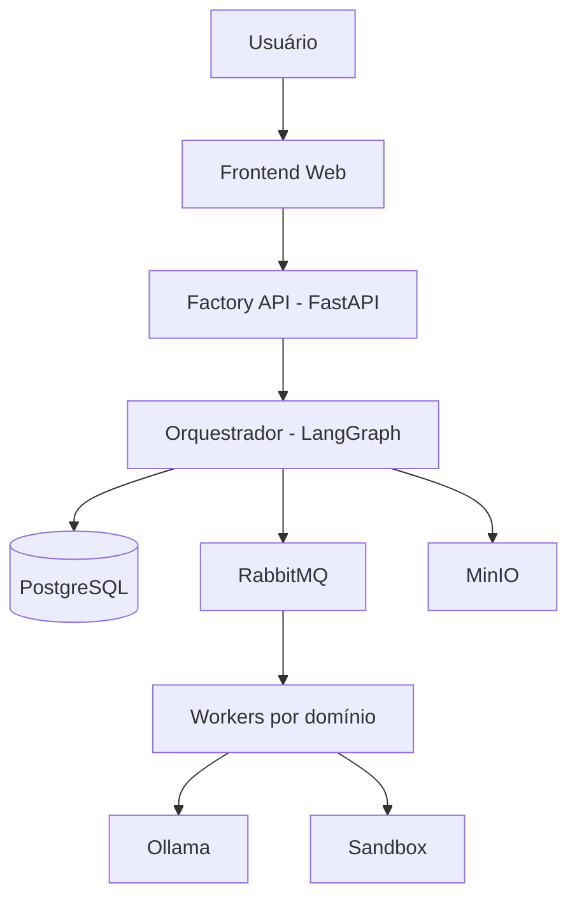

# Visão da arquitetura

Ver a proposta original (v1.0) para o detalhamento completo. Resumo:

- **Frontend** (Next.js) → **Factory API** (FastAPI) → **Orquestrador** (LangGraph)
- Orquestrador → PostgreSQL (fonte de verdade), RabbitMQ (filas por domínio), MinIO (artefatos)
- 8 workers por domínio consomem `factory.<dominio>` e executam agentes lógicos via Ollama
- Execução de código somente em sandbox efêmero
- Observabilidade: OTel Collector → Prometheus/Loki → Grafana; Langfuse para LLM

